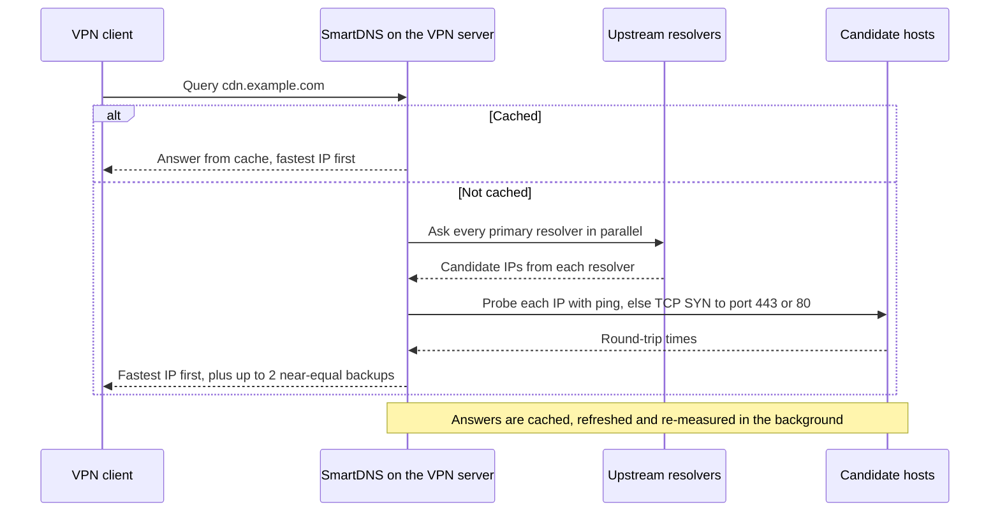

<h1 align="center">SmartDNS for VPN &amp; Proxy Servers</h1>

<p align="center">
  A one-command installer that turns an Ubuntu 22.04 VPN or proxy server into a hardened, self-healing
  DNS resolver that answers every lookup with the fastest IP, measured from the server itself.
</p>

<p align="center">
  
  
  
  
</p>

---

`install-smartdns.sh` installs [SmartDNS](https://github.com/pymumu/smartdns) from its official releases and tunes it for servers whose clients reach the internet *through* the server: WireGuard, OpenVPN and IPsec gateways, Tailscale exit nodes, Xray and sing-box nodes. It is built for servers with thousands of concurrent clients.

Ordinary DNS returns whichever addresses a CDN *guesses* are closest to your resolver. This setup measures instead. It collects candidate addresses from several resolvers, probes each one from the server (the same path your users' connections take), and answers with the fastest. A large persistent cache with prefetch and serve-stale answers peak-hour traffic from memory. Background re-measurement keeps the chosen addresses current.

**Install in one command** on an Ubuntu 22.04 server (see [Quick start](#quick-start) for details):

```bash
curl -fsSLO https://raw.githubusercontent.com/xmohammad1/SmartDNS/main/install-smartdns.sh &&
  sudo bash install-smartdns.sh
```

## Highlights

- **Fastest IP, measured.** Candidates come from parallel upstreams and are latency-probed from the server; the fastest goes first.
- **Instant under load.** A cache sized from RAM, persisted to disk, with prefetch and serve-stale. Restarts come back warm.
- **Never an open resolver.** A SmartDNS ACL plus a kernel-level nftables guard, with optional per-client rate limiting.
- **Hardened.** Unprivileged runtime user, systemd sandbox, SHA-256-verified packages, no query logging by default.
- **Safe to re-run.** Transactional with automatic rollback, idempotent, and previewable with `--dry-run`.
- **Self-healing.** Restarted on crash, plus a 30-second liveness watchdog for hangs. `--verify` checks health on demand.
- **Seamless cut-over.** SmartDNS takes over `127.0.0.53`, so the host and host-network containers switch to it without a restart.

## Contents

- [How it works](#how-it-works)
- [Requirements](#requirements)
- [Quick start](#quick-start)
- [Usage](#usage)
- [Examples](#examples)
- [Configuration](#configuration)
- [Security](#security)
- [Operations](#operations)
- [Uninstall](#uninstall)
- [Troubleshooting](#troubleshooting)
- [Acknowledgements](#acknowledgements)

## How it works



1. **Wide candidate pool.** On a cache miss, SmartDNS queries every primary upstream in parallel: Cloudflare (`1.1.1.1`) and Google (`8.8.8.8`) by default. Independent providers map CDNs differently, so together they return more candidates than either one alone. `1.0.0.1` and `8.8.4.4` are used only when the primaries fail or time out.
2. **Measured, not guessed.** Every candidate is probed from the server with ICMP ping. Hosts that ignore ping get a TCP handshake on port 443, then on port 80. The lowest-latency address comes first. Up to two more follow only if they are nearly as fast, giving clients a failover target.
3. **Instant and self-correcting.** Answers are cached and persisted to disk. Names in use are refreshed in the background, and expired entries are answered immediately while they refresh. Every refresh re-measures the candidates. Clients cache answers for at most 60 seconds, so they pick up a new winner quickly.

## Requirements

| Requirement | Details |
|---|---|
| Operating system | Ubuntu 22.04 LTS. Other releases can be attempted with `--force` (untested). |
| Init system | systemd |
| Architecture | amd64, arm64, armhf/armel, i386 |
| Privileges | root (`sudo`) |
| Network | HTTPS to GitHub to download SmartDNS (not needed with `--deb`); outbound DNS (UDP/TCP 53) to the upstream resolvers; outbound ICMP and TCP 80/443 for latency probes |
| Disk | A few hundred MB free on `/var` for the persistent cache and logs |

Missing tools (`curl`, `jq`, `dig`, `ss`, `sysctl`, `flock`, `nft` and the CA certificates) are installed automatically with apt. Inside containers some kernel settings or nftables may be unavailable. When that happens the installer warns and continues without them.

## Quick start

Run this on the server:

```bash
curl -fsSLO https://raw.githubusercontent.com/xmohammad1/SmartDNS/main/install-smartdns.sh &&
  sudo bash install-smartdns.sh
```

This downloads `install-smartdns.sh` into the current directory and runs it. Keep the file: you will use it later for `--verify`, upgrades and `--uninstall`.

- **Custom settings:** append [options](#usage) to the command, for example `sudo bash install-smartdns.sh --allow 10.8.0.0/24`.
- **Preview first:** run only the `curl` part, then `sudo bash install-smartdns.sh --dry-run` to see the files it would write without changing anything.

With no options, SmartDNS listens on port 53 on every interface and answers clients on private (RFC 1918), CGNAT and IPv6 ULA networks. It also becomes the server's own resolver. The run ends by testing itself and printing a summary:

<details>
<summary>Example summary</summary>

```text
✔ SmartDNS is live  (smartdns <version>)

  Listening    [::]:53 (udp+tcp)
               also answers 127.0.0.53 for this host and host-network containers
  Clients      127.0.0.0/8, ::1/128, 10.0.0.0/8, 172.16.0.0/12, 192.168.0.0/16, 100.64.0.0/10, fc00::/7
  Upstreams    1.1.1.1, 8.8.8.8 (+2 fallback)
  Best IP      fastest-ip, probes ping,tcp-syn:443,tcp-syn:80, up to 3 per answer (fastest first)
  Cache        125280 entries, persistent, re-measured every 300-3600 s
  IPv6         AAAA off (no IPv6 egress)
  Guard        nftables table inet smartdns_guard
  Watchdog     smartdns-healthcheck.timer (every 30 s)
  Config       /etc/smartdns/smartdns.conf (overrides: /etc/smartdns/conf.d/)
  Logs         /var/log/smartdns/smartdns.log
  Backups      /var/backups/smartdns-installer/20260927-101500

  Point VPN clients at the tunnel address of this server:
    wg0          DNS = 10.8.0.1

  Health check any time:  sudo bash install-smartdns.sh --verify
```

</details>

Then point your VPN clients at the server's tunnel address. The summary lists it for every WireGuard, OpenVPN, PPP, IPsec, Tailscale or ZeroTier interface it finds.

| Client | Setting |
|---|---|
| WireGuard | `DNS = 10.8.0.1` in the client's `[Interface]` section |
| OpenVPN | `push "dhcp-option DNS 10.8.0.1"` in the server configuration |
| Proxy cores on the same host (Xray, sing-box, …) | Nothing to do if they use the system resolver. Otherwise point their DNS settings at `127.0.0.1` |

## Usage

```text
sudo bash install-smartdns.sh [options]
```

Without an action flag, the script installs or upgrades SmartDNS, writes its configuration, verifies it and prints a summary. Options can be written as `--option value` or `--option=value`. `--allow`, `--listen` and `--upstream` can be repeated, and `--allow` and `--listen` also accept comma-separated lists. Run `bash install-smartdns.sh --help` for the built-in reference.

> [!IMPORTANT]
> Options are not remembered between runs. Each run regenerates the configuration from the options on its own command line. Unless you pass `--release`, each run also upgrades SmartDNS to the latest release. Keep your full command in a runbook and reuse it for upgrades.

### Actions

| Option | Description |
|---|---|
| *(none)* | Install or upgrade SmartDNS, configure it, verify it and print a summary. |
| `--verify` | Health-check the running installation and exit. Exits non-zero if SmartDNS is unhealthy. |
| `--uninstall` | Remove SmartDNS and restore the previous resolver setup. |
| `--uninstall --purge` | Also delete the configuration, cache, logs, installer state and the `smartdns` user. |
| `--dry-run` | Render the configuration files into a temporary directory (kept for inspection) and print the generated `smartdns.conf`. Changes nothing and does not need root. |
| `-h`, `--help` | Show the built-in help. |

### Clients and listeners

| Option | Default | Description |
|---|---|---|
| `--allow CIDR[,CIDR…]` | `10.0.0.0/8`<br>`172.16.0.0/12`<br>`192.168.0.0/16`<br>`100.64.0.0/10`<br>`fc00::/7` | Client networks allowed to query. Giving this option **replaces** the default list. Loopback is always allowed, including local programs that query the server's public IP. |
| `--listen IP[,IP…]` | all interfaces | Bind only these addresses; loopback is added automatically. Kernel tuning also enables `ip_nonlocal_bind`, so SmartDNS can bind a tunnel address at boot before the tunnel is up. |
| `--port N` | `53` | DNS port. On any other port, the server's own resolver is left untouched, which is handy for a trial run. |
| `--ipv6 auto\|on\|off` | `auto` | Return AAAA records. `auto` enables them only when the server has a global IPv6 address and a default route. Otherwise AAAA queries get an empty answer, so clients never stall on IPv6 inside the tunnel. |

### Resolution

| Option | Default | Description |
|---|---|---|
| `--upstream SPEC` | `1.1.1.1`, `8.8.8.8`<br>fallback: `1.0.0.1`, `8.8.4.4` | An upstream in SmartDNS [`server`](https://github.com/pymumu/smartdns/blob/master/etc/smartdns/smartdns.conf) syntax: an IP, `IP:port` or a `tls://`, `https://` or `quic://` URL, optionally with flags such as `-fallback`. Repeatable. Giving it **replaces** all defaults, fallbacks included. |
| `--response-mode MODE` | `fastest-ip` | `fastest-ip`, `first-ping` or `fastest-response`. See [response modes](#response-modes). |
| `--speed-check LIST` | `ping,tcp-syn:443,tcp-syn:80` | Probe order. Each method is used for hosts that did not answer the previous one. Items: `ping`, `tcp:PORT`, `tcp-syn:PORT`, or `none`. |
| `--max-ips N` | `3` | Addresses per answer (1–16). The fastest is always first; the others are included only if they are nearly as fast. |
| `--cache-size N` | `auto` | Cache entries. `auto` allows 32 per MiB of RAM, between 32,768 and 1,048,576. |
| `--ttl-min SECONDS` | `300` | Lower bound for cached TTLs. When an entry's TTL runs out, the entry is re-resolved and its IPs re-measured. |
| `--ttl-max SECONDS` | `3600` | Upper bound for cached TTLs. |
| `--ttl-reply-max SECONDS` | `60` | Longest TTL given to clients, so they pick up a new fastest IP quickly. |

#### Response modes

| Mode | First (uncached) answer | Trade-off |
|---|---|---|
| `fastest-ip` | Sent after every candidate has been probed, fastest first | Best choice from the very first query; a cache miss waits for the probes |
| `first-ping` | Sent as soon as the first candidate answers a probe (usually the fastest) | Faster cache misses; the full ranking is cached for the queries that follow |
| `fastest-response` | Sent with the first upstream reply, without waiting for probes | Fastest cache misses; only cached answers are ranked by latency |

### System

| Option | Default | Description |
|---|---|---|
| `--rate-limit QPS` | off | Per-client UDP query limit enforced in nftables, with bursts of up to twice the rate. Has no effect with `--no-firewall`. |
| `--no-firewall` | | Skip the nftables guard and ufw rules. The SmartDNS ACL still applies. |
| `--no-kernel-tuning` | | Skip sysctl and conntrack tuning. |
| `--audit` | off | Log every query to `/var/log/smartdns/smartdns-audit.log` (rotated at 64 MiB × 4). |
| `--log-level LEVEL` | `warn` | `off`, `fatal`, `error`, `warn`, `notice`, `info` or `debug`. |

### Package

| Option | Default | Description |
|---|---|---|
| `--release TAG` | latest | SmartDNS release to install, for example `Release48.4` (or just `48.4`). |
| `--deb FILE` | | Install a local `.deb` instead of downloading one. Use it for hosts that cannot reach GitHub or to pin an exact build. |
| `--force` | | Continue on an operating system other than Ubuntu 22.04. |

| Environment variable | Description |
|---|---|
| `GITHUB_TOKEN` | Optional GitHub token that avoids API rate limits: `sudo GITHUB_TOKEN=<token> bash install-smartdns.sh` |

## Examples

**Answer only your VPN subnet**

```bash
sudo bash install-smartdns.sh --allow 10.8.0.0/24
```

**Listen on the tunnel address only.** SmartDNS binds `10.8.0.1` plus loopback, and leaves port 53 on the server's other addresses free for other services.

```bash
sudo bash install-smartdns.sh --listen 10.8.0.1 --allow 10.8.0.0/24
```

**Try it alongside an existing resolver.** On a port other than 53 the server's own DNS setup is not touched.

```bash
sudo bash install-smartdns.sh --port 5300
dig @127.0.0.1 -p 5300 www.google.com
```

**Use encrypted upstreams.** IP-literal URLs need no bootstrap lookup, and the system CA bundle is configured automatically. Plain DNS (the default) has the lowest cache-miss latency. Encrypted transports hide upstream queries from on-path observers.

```bash
sudo bash install-smartdns.sh \
  --upstream https://1.1.1.1/dns-query \
  --upstream tls://8.8.8.8:853 \
  --upstream "9.9.9.9 -fallback"
```

**Rate-limit clients.** Each client may send 50 queries per second, in bursts of up to 100; excess UDP queries are dropped in the kernel. Size the limit for your busiest legitimate client, because clients behind a shared NAT address count as one. Loopback traffic is never limited.

```bash
sudo bash install-smartdns.sh --rate-limit 50
```

**Pin the tested SmartDNS release.** By default the latest release is installed.

```bash
sudo bash install-smartdns.sh --release Release48.4
```

**Install from a local package.** Download the `*.<arch>-debian-all.deb` asset (`x86_64`, `aarch64`, `arm` or `x86`) from the [SmartDNS releases](https://github.com/pymumu/smartdns/releases) page.

```bash
sudo bash install-smartdns.sh --deb ./smartdns.<version>.x86_64-debian-all.deb
```

## Configuration

### Local overrides

The installer generates `/etc/smartdns/smartdns.conf` from your options and **rewrites it on every run**, so don't edit it. Put your own settings in `/etc/smartdns/conf.d/*.conf` instead. Those files are loaded after the generated configuration and survive re-runs and upgrades. The first install creates `00-local.conf` there with commented examples such as:

```conf
# Fixed answer for an internal name
address /intranet.example.com/10.8.0.10

# Don't latency-probe one domain
domain-rules /example.org/ -speed-check-mode none

# Send one zone to a private resolver
server 10.0.0.53 -group corp -exclude-default-group
nameserver /corp.example.com/corp
```

Apply changes with `sudo systemctl restart smartdns`. SmartDNS's [annotated sample configuration](https://github.com/pymumu/smartdns/blob/master/etc/smartdns/smartdns.conf) documents every directive. For systemd settings, add your own drop-in next to the managed one, for example `/etc/systemd/system/smartdns.service.d/20-local.conf`.

### Built-in settings

These are not exposed as options. Override them in `conf.d` if you need to.

| Area | Behavior |
|---|---|
| Persistent cache | Stored in `/var/lib/smartdns/smartdns.cache` and snapshotted hourly, so restarts and reboots start warm instead of stampeding the upstreams |
| Prefetch | Names in use are refreshed, and their IPs re-measured, in the background |
| Serve-stale | Expired entries are answered immediately with a 3-second TTL while they refresh. Entries unused for 3 days are dropped |
| Dual stack | With IPv6 egress, the faster address family wins. Without it, AAAA queries get an empty answer |
| TCP | Idle client connections close after 30 seconds (SmartDNS caps itself at 10,240 open files) |
| Socket buffers | 4 MiB, to absorb peak-hour query bursts |
| Local answers | `health.smartdns.internal` resolves to `127.0.0.1` for the watchdog. `use-application-dns.net` gets a negative answer, so Firefox keeps using this resolver instead of its own DNS-over-HTTPS |
| Logging | `/var/log/smartdns/smartdns.log`, rotated at 16 MiB × 4, mode `0640` |

### Automatic sizing

The cache holds 32 entries per MiB of RAM, between 32,768 and 1,048,576 entries (about 0.5 KiB each). When connection tracking is loaded, `nf_conntrack_max` is raised, if lower, to 64 per MiB of RAM, between 262,144 and 4,194,304, with a quarter as many hash buckets. Both are computed from `MemTotal`, so a "4 GB" server that reports slightly less gets a slightly smaller figure.

| RAM | Cache entries | `nf_conntrack_max` |
|---|---|---|
| 1 GiB or less | 32,768 | 262,144 |
| 2 GiB | 65,536 | 262,144 |
| 4 GiB | 131,072 | 262,144 |
| 8 GiB | 262,144 | 524,288 |
| 16 GiB | 524,288 | 1,048,576 |
| 32 GiB | 1,048,576 | 2,097,152 |
| 64 GiB or more | 1,048,576 | 4,194,304 |

### Kernel tuning

Kernel tuning is **raise-only**. A limit that is already higher, for example one tuned for your VPN, is kept. Only values the installer actually raised are persisted, in `/etc/sysctl.d/99-zz-smartdns.conf`. Skip all of it with `--no-kernel-tuning`.

| Parameter | Target | Purpose |
|---|---|---|
| `net.core.rmem_max`, `net.core.wmem_max` | 16 MiB | Lets the 4 MiB socket buffers take full effect |
| `net.core.netdev_max_backlog` | 16,384 | A deeper NIC-to-kernel queue at high packet rates |
| `net.netfilter.nf_conntrack_max` and hash size | See [automatic sizing](#automatic-sizing) | Connection-tracking headroom for many clients; the conntrack module is loaded early at boot so the setting applies |
| `net.ipv4.ip_nonlocal_bind`, `net.ipv6.ip_nonlocal_bind` | `1` | Only with `--listen`: bind tunnel addresses before the tunnel is up |

When connection tracking is active, the nftables guard also exempts loopback DNS from it. Thousands of one-packet local UDP exchanges per second (from the host and local proxy cores) would otherwise churn the conntrack table.

### Files and services

<details>
<summary>Everything the installer creates or manages</summary>

| Path | Purpose |
|---|---|
| `/etc/smartdns/smartdns.conf` | Generated configuration, rewritten on every run |
| `/etc/smartdns/conf.d/*.conf` | Your local overrides. The installer creates `00-local.conf` if it is missing and otherwise leaves this directory alone |
| `/etc/smartdns/guard.nft` | nftables guard ruleset |
| `/etc/systemd/system/smartdns.service.d/10-vpn-tuning.conf` | Service drop-in: restart policy, scheduling priority, sandbox |
| `/etc/systemd/system/smartdns-guard.service` | Loads the guard at boot, before the network comes up |
| `/usr/local/sbin/smartdns-healthcheck` | Liveness probe script |
| `/etc/systemd/system/smartdns-healthcheck.{service,timer}` | Runs the probe every 30 seconds |
| `/etc/systemd/resolved.conf.d/90-smartdns.conf` | Port 53 with systemd-resolved: turns off its stub listener and forwards to SmartDNS |
| `/etc/resolv.conf` | Replaced with `nameserver 127.0.0.1` only when systemd-resolved does not manage it. The original is kept for `--uninstall` |
| `/etc/sysctl.d/99-zz-smartdns.conf` | Kernel limits the installer raised |
| `/etc/modprobe.d/smartdns-conntrack.conf`<br>`/etc/modules-load.d/smartdns-conntrack.conf` | Conntrack hash size, and early loading of the module at boot |
| `/var/lib/smartdns/` | Persistent cache |
| `/var/log/smartdns/` | SmartDNS log, plus the audit log with `--audit` |
| `/var/log/smartdns-installer.log` | Installer log |
| `/var/backups/smartdns-installer/<timestamp>/` | Copies of every file the installer replaced |
| `/var/lib/smartdns-installer/state` | State used by `--verify` and `--uninstall` |

The `smartdns` package provides `/usr/sbin/smartdns` and `smartdns.service`. The daemon runs as the `smartdns` system user.

</details>

## Security

| Layer | What it does |
|---|---|
| SmartDNS ACL | Answers only the allowed networks, loopback and the server's own addresses. Everyone else gets `REFUSED`. |
| nftables guard | A separate `inet smartdns_guard` table drops DNS from disallowed sources in the kernel, before SmartDNS sees it, so the server cannot be used as a DDoS amplifier. It matches only the DNS port and leaves every other firewall rule alone. It is validated with `nft -c` before installation and loaded at boot before the network comes up. |
| ufw | When ufw is active, adds a rule allowing the DNS port from each allowed network (commented `SmartDNS clients`). `--uninstall` removes them. |
| Rate limiting | Optional per-client query limit (`--rate-limit`). |
| Least privilege | SmartDNS drops to the unprivileged `smartdns` user right after start-up. The systemd drop-in adds a capability bounding set, `NoNewPrivileges`, `ProtectSystem=full`, `ProtectHome`, `PrivateTmp`, `PrivateDevices`, `MemoryDenyWriteExecute`, kernel and namespace protections, and an address-family allow-list. |
| Supply chain | Packages come from the official `pymumu/smartdns` GitHub releases. Each download is checked against the SHA-256 digest GitHub publishes for it (the installer warns if none is published) and must identify as the `smartdns` package. |
| Privacy | No per-query logging unless you pass `--audit`. Log files are not world-readable. |

If the kernel rejects the guard (as in some restricted containers), the installer warns and relies on the SmartDNS ACL alone.

## Operations

### Health check

```bash
sudo bash install-smartdns.sh --verify
```

This checks that SmartDNS is running and answering locally, that the upstream resolvers respond, and that UDP and TCP lookups work. On port 53 it also checks that the host's resolver goes through SmartDNS. It then reports whether the nftables guard and the watchdog are active, and shows recent warnings from the SmartDNS log. The command exits non-zero when a resolver check fails, so you can call it from monitoring or cron.

### Everyday commands

```bash
systemctl status smartdns                         # service state
sudo journalctl -u smartdns -f                    # service journal
sudo tail -f /var/log/smartdns/smartdns.log       # SmartDNS log
sudo journalctl -t smartdns-healthcheck           # restarts triggered by the watchdog
sudo nft list table inet smartdns_guard           # guard rules and drop counters
dig @10.8.0.1 www.google.com                      # test from a VPN client
```

Crashes are handled by `Restart=always`. The watchdog handles hangs: every 30 seconds it queries SmartDNS for a locally answered name, and restarts the service after three failed attempts. SmartDNS also runs with a higher scheduling priority (`Nice=-5`) and is less likely to be picked by the OOM killer (`OOMScoreAdjust=-500`).

### Upgrades and configuration changes

Re-run the installer with your full set of options. It installs the latest SmartDNS release (or the one given with `--release`), regenerates the configuration and backs up every file it replaces. SmartDNS restarts only if its package or configuration changed. Your `conf.d` overrides are kept. To update the installer itself, download it again first.

### Backups and rollback

Before replacing any file, the installer copies it to `/var/backups/smartdns-installer/<timestamp>/` under its original path. If a run fails after it starts changing the system, including when the final health checks fail, it rolls itself back:

- replaced files are restored and new files removed
- newly enabled units are disabled and ufw rules it added are deleted
- systemd-resolved is restarted and a previously running SmartDNS is started again

Every step is recorded in `/var/log/smartdns-installer.log`.

## Uninstall

```bash
sudo bash install-smartdns.sh --uninstall           # keep configuration, cache and logs
sudo bash install-smartdns.sh --uninstall --purge   # also delete them, and the smartdns user
```

Uninstalling stops and disables every SmartDNS unit and removes the nftables guard, the unit files and the tuning files. It restores the systemd-resolved stub listener or the original `/etc/resolv.conf`, deletes the ufw rules it added and removes the package. Raised kernel limits stay in effect until the next reboot. Backups and the installer log are kept.

## Troubleshooting

| Symptom | What to do |
|---|---|
| `Port 53 is already in use` | Another DNS service (dnsmasq, bind9, unbound, a container, …) holds the port. Stop it, or bind SmartDNS to specific addresses with `--listen`. systemd-resolved is handled automatically. |
| `Cannot query GitHub` | The GitHub API is rate-limited or unreachable. Set `GITHUB_TOKEN`, or install from a local package with `--deb`. |
| `Upstream resolvers do not answer` | Outbound DNS to the upstreams is blocked. Allow UDP/TCP 53 outbound, or use encrypted upstreams such as `--upstream https://1.1.1.1/dns-query`. The failed run has already been rolled back. |
| `nftables rejected the guard ruleset` | Common in restricted containers. Installation continues and the SmartDNS ACL still refuses unknown clients. Pass `--no-firewall` to skip the guard. |
| Clients time out, but the server itself resolves | Make sure the client's address is inside `--allow`; the guard silently drops everyone else. Also check that the host firewall admits port 53 from the tunnel. With ufw active the installer adds the rules itself. With an iptables `INPUT` policy of `DROP`, it prints the rule to add, for example `iptables -I INPUT -i wg0 -p udp --dport 53 -j ACCEPT` (add the same for TCP). |
| `/etc/resolv.conf` keeps being overwritten | NetworkManager or resolvconf manages it on this host. Configure it to use `127.0.0.1`. |
| The installer refuses to run on your OS | It targets Ubuntu 22.04. Pass `--force` to try anyway. |

For anything else, start with `/var/log/smartdns-installer.log`, `sudo journalctl -u smartdns` and `/var/log/smartdns/smartdns.log`. For a more verbose SmartDNS log, add `--log-level info` (or `debug`) to your usual install command and re-run it.

## Acknowledgements

[SmartDNS](https://github.com/pymumu/smartdns) is developed by [pymumu](https://github.com/pymumu) and contributors. This project is an independent installer that deploys the official, unmodified SmartDNS release packages.
